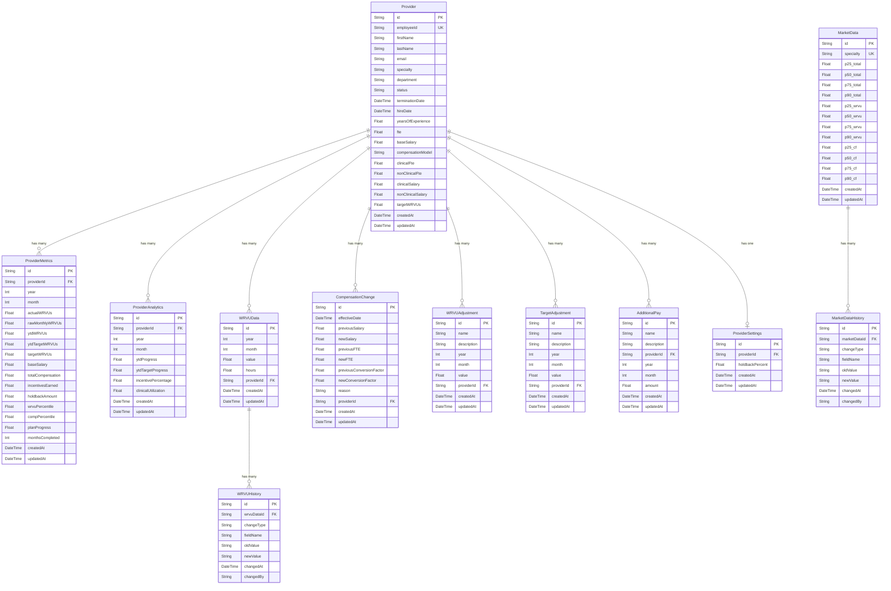

```mermaid
erDiagram
    Provider {
        String id PK
        String employeeId UK
        String firstName
        String lastName
        String email
        String specialty
        String department
        String status
        DateTime terminationDate
        DateTime hireDate
        Float yearsOfExperience
        Float fte
        Float baseSalary
        String compensationModel
        Float clinicalFte
        Float nonClinicalFte
        Float clinicalSalary
        Float nonClinicalSalary
        Float targetWRVUs
        DateTime createdAt
        DateTime updatedAt
    }

    ProviderMetrics {
        String id PK
        String providerId FK
        Int year
        Int month
        Float actualWRVUs
        Float rawMonthlyWRVUs
        Float ytdWRVUs
        Float ytdTargetWRVUs
        Float targetWRVUs
        Float baseSalary
        Float totalCompensation
        Float incentivesEarned
        Float holdbackAmount
        Float wrvuPercentile
        Float compPercentile
        Float planProgress
        Int monthsCompleted
        DateTime createdAt
        DateTime updatedAt
    }

    ProviderAnalytics {
        String id PK
        String providerId FK
        Int year
        Int month
        Float ytdProgress
        Float ytdTargetProgress
        Float incentivePercentage
        Float clinicalUtilization
        DateTime createdAt
        DateTime updatedAt
    }

    WRVUData {
        String id PK
        Int year
        Int month
        Float value
        Float hours
        String providerId FK
        DateTime createdAt
        DateTime updatedAt
    }

    MarketData {
        String id PK
        String specialty UK
        Float p25_total
        Float p50_total
        Float p75_total
        Float p90_total
        Float p25_wrvu
        Float p50_wrvu
        Float p75_wrvu
        Float p90_wrvu
        Float p25_cf
        Float p50_cf
        Float p75_cf
        Float p90_cf
        DateTime createdAt
        DateTime updatedAt
    }

    CompensationChange {
        String id PK
        DateTime effectiveDate
        Float previousSalary
        Float newSalary
        Float previousFTE
        Float newFTE
        Float previousConversionFactor
        Float newConversionFactor
        String reason
        String providerId FK
        DateTime createdAt
        DateTime updatedAt
    }

    WRVUAdjustment {
        String id PK
        String name
        String description
        Int year
        Int month
        Float value
        String providerId FK
        DateTime createdAt
        DateTime updatedAt
    }

    TargetAdjustment {
        String id PK
        String name
        String description
        Int year
        Int month
        Float value
        String providerId FK
        DateTime createdAt
        DateTime updatedAt
    }

    AdditionalPay {
        String id PK
        String name
        String description
        String providerId FK
        Int year
        Int month
        Float amount
        DateTime createdAt
        DateTime updatedAt
    }

    ProviderSettings {
        String id PK
        String providerId FK
        Float holdbackPercent
        DateTime createdAt
        DateTime updatedAt
    }

    WRVUHistory {
        String id PK
        String wrvuDataId FK
        String changeType
        String fieldName
        String oldValue
        String newValue
        DateTime changedAt
        String changedBy
    }

    MarketDataHistory {
        String id PK
        String marketDataId FK
        String changeType
        String fieldName
        String oldValue
        String newValue
        DateTime changedAt
        String changedBy
    }

    Provider ||--o{ ProviderMetrics : "has many"
    Provider ||--o{ ProviderAnalytics : "has many"
    Provider ||--o{ WRVUData : "has many"
    Provider ||--o{ CompensationChange : "has many"
    Provider ||--o{ WRVUAdjustment : "has many"
    Provider ||--o{ TargetAdjustment : "has many"
    Provider ||--o{ AdditionalPay : "has many"
    Provider ||--o| ProviderSettings : "has one"
    WRVUData ||--o{ WRVUHistory : "has many"
    MarketData ||--o{ MarketDataHistory : "has many"
``` 